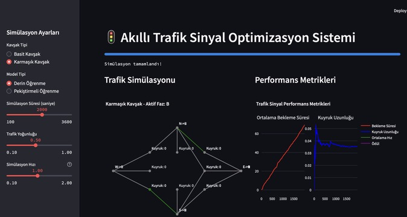

 
 
# Akıllı Trafik Sinyal Optimizasyon Sistemi

Bu proje, trafik sinyal optimizasyonu için derin öğrenme ve pekiştirmeli öğrenme yaklaşımlarını karşılaştıran bir sistemdir.

## Özellikler

- SUMO trafik simülasyonu entegrasyonu
- PyTorch tabanlı derin öğrenme modeli
- Pekiştirmeli öğrenme ajanları
- OpenRouter LLM entegrasyonu
- Gerçek zamanlı performans görselleştirme
- Streamlit tabanlı kullanıcı arayüzü

## Kurulum

1. Gerekli paketleri yükleyin:
```bash
pip install -r requirements.txt
```

2. SUMO'yu yükleyin:
- macOS: `brew install sumo`
- Linux: `sudo apt-get install sumo sumo-tools sumo-doc`

3. Çevre değişkenlerini ayarlayın:
```bash
cp .env.example .env
# .env dosyasını düzenleyin
```

## Kullanım

```bash
streamlit run src/app.py
```

********************** 2000 saniyelik 4 yol ağzı ışık simülasyonunda trafik yoğunluğu 0.50 iken : ******************************

Pekiştirmeli öğrenme - 
{
  "waiting_time": 77.75,
  "queue_length": 0,
  "average_speed": 6.945,
  "reward": -4.997
}

Derin Öğrenme - 
{
"waiting_time":433
"queue_length":0
"average_speed":6.945
"reward":-40.522000000000006
}

********************** 2000 saniyelik karmaşık kavşak modelinde trafik yoğunluğu 0.5 iken : ******************************

Pekiştirmeli öğrenme - 
{
  "waiting_time": 63.75,
  "queue_length": 0.0359,
  "average_speed": 13.89,
  "reward": 518.54
}

Derin Öğrenme - 
{
  "waiting_time": 69.5,
  "queue_length": 0.0320,
  "average_speed": 13.89,
  "reward": 501.55
}

1. Derin Öğrenme (DL) Modeli
Kural tabanlı ve veri odaklıdır.
Trafik kavşağındaki mevcut durumu (araç sayısı, kuyruk uzunluğu, bekleme süresi, hız vb.) giriş olarak alır.
Her faz için toplam kuyruk ve bekleme süresini skorlar, en iyi fazı seçer.
Model, geçmiş verilerden öğrenerek veya kural tabanlı olarak en uygun trafik ışığı fazını belirler.
DL modelinde ödül fonksiyonu sadece performans göstergesi olarak kullanılır, modelin eğitimi için kullanılmaz.
2. Pekiştirmeli Öğrenme (RL) Ajanı
Deneme-yanılma yoluyla öğrenir.
Ajan, her adımda bir aksiyon (trafik ışığı fazı) seçer ve ortamdan bir ödül/ceza alır.
Amaç, toplam ödülü maksimize edecek şekilde trafik ışıklarını optimize etmektir.
RL ajanı, ortamdan aldığı ödül sinyaline göre kendi politikasını günceller ve zamanla daha iyi kararlar almayı öğrenir.
RL modelinde ödül fonksiyonu doğrudan öğrenme sürecini yönlendirir.
